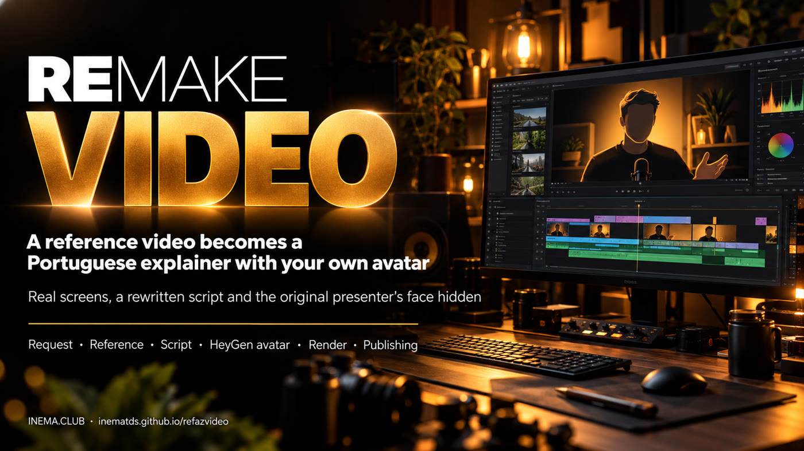

# refazvideo

**🇧🇷 [Português](README.md) · 🇺🇸 [English](README.en.md) · 🇪🇸 [Español](README.es.md)**

## What it is

refazvideo is a step-by-step method, with ready-made tools, for an AI agent (Claude Code or Codex) to remake a video you liked as your own explainer video in Portuguese. It is for content creators who want to explain a new subject without filming themselves. You hand over the subject and the link; the agent downloads, transcribes, writes a new script, shows a preview, and only generates the avatar after your "go ahead". To use it you need the explicavideos engine, a HeyGen account with your avatar, and a machine with a GPU.

## 📖 User guide

Full guide (landing + step by step): **https://inematds.github.io/refazvideo/guia/en/**

---

Remakes a reference video as an **explainer video in Portuguese**, with the presenter's avatar and voice
(HeyGen), the real screens from the reference with highlights synced to the speech, and animations.

**How to use:** open Claude Code (or Codex) in this folder and ask:

> Make a new video. Subject: \<topic\>. Reference: \<video URL\>. Do not mention: \<author\>. Delivery: bot v3.

The agent follows `AGENTS.md` (in Portuguese): it downloads and transcribes the reference, picks the screenshots, writes the script,
shows a storyboard for approval, generates the avatar in HeyGen **only after the "go ahead"**, renders,
checks frames and delivers (Telegram and/or YouTube). The request form is in `modelos/pedido.md`.

## Contents

| folder | what |
|---|---|
| `AGENTS.md` | the step-by-step the agent follows (rules, commands, done criteria) |
| `LICOES.md` | what has already broken and the safeguard for each case |
| `modelos/` | request, explicavideos v1/v2 configs |
| `ferramentas/` | frame contact sheets, screenshot prep (cover face, pad), visual validation, storyboard, download of HeyGen blocks through the studio, sending through bot v3 |
| `exemplos/decisions-jev/` | real case: script, visuals for the 2 blocks, commands that were run ([published video](https://www.youtube.com/watch?v=O2061m5FG_I)) |

## Prerequisites

- [`explicavideos`](https://github.com/inematds/explicavideos) (render engine, HyperFrames 0.8.77) and `inemavox` (download/transcription).
- A HeyGen account with your own avatar, logged in to a browser profile (`heygen-studio.mjs` uses the studio, not the API).
- `ffmpeg`, Python 3 with Pillow, Node 20+. Optional: Telegram bot (openpcbotv3) and `yt-pubx`.

The example paths are from the INEMA machine (`/home/nmaldaner/...`); replace them with yours.

## Responsible use

Use references you are allowed to reuse. The new video is your own explanation, with a rewritten script;
do not reproduce the original video or show the face of whoever presented it.

Free projects and courses: https://inema.club
